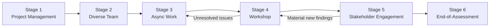

# How to Run the UNESCO EIA

This guide walks through the six stages of a UNESCO Ethical Impact Assessment. Each stage has defined participants, activities, and deliverables. The stages are designed to be completed sequentially, though Stages 3 and 5 can overlap with Stage 4 in iterative processes.

---

## Assessment Flowchart

---

## Stage 1 — Project Management

### Purpose
Establish governance for the assessment: designate a lead, define scope, allocate time and resources, and set a realistic timeline.

### Participants
- Assessment Lead (mandatory)
- Sponsoring executive or project owner
- HR or resource allocation contact

### Key Activities

- Identify the AI system to be assessed and pin the exact version or release
- Define the scope boundaries (which use cases, geographies, user groups are in scope)
- Appoint the Assessment Lead who will be accountable for the process
- Set the assessment timeline with milestones for each stage
- Allocate budget and time for external stakeholder engagement (Stage 5)
- Confirm access to relevant documentation (technical specs, data cards, prior audits)

### Outputs / Deliverables

- Signed project charter or scoping document
- Assessment timeline with stage deadlines
- GitHub Issue opened using [eia-stage-1-scoping template](https://github.com/felipelago17/Responsible-AI-evaluation/issues/new?template=eia-stage-1-scoping.yml)

---

## Stage 2 — Constituting the Diverse Team

### Purpose
Assemble a multidisciplinary team that can evaluate the AI system from multiple perspectives. Diversity of expertise reduces blind spots.

### Participants
- Assessment Lead (facilitator)
- Recruits from technical, legal, ethics, domain-expert, and community-representative pools

### Key Activities

- Map the disciplines required for a complete assessment (technical AI/ML, legal, ethics, domain expertise, affected community representation)
- Identify and recruit team members, prioritising diversity of background, gender, geography, and perspective
- Document any gaps in representation and plan to address them (e.g., via Stage 5 stakeholder engagement)
- Brief all team members on the EIA methodology, the UNESCO Recommendation, and their role
- Establish communication channels and document sharing infrastructure

### Outputs / Deliverables

- Team roster with roles and disciplines documented
- Gap analysis of missing perspectives
- GitHub Issue opened using [eia-stage-2-team template](https://github.com/felipelago17/Responsible-AI-evaluation/issues/new?template=eia-stage-2-team.yml)

---

## Stage 3 — Asynchronous Work

### Purpose
Each team member independently completes the EIA workbook to surface diverse perspectives before group discussion. Independence at this stage reduces anchoring bias.

### Participants
- All team members (individually)
- Assessment Lead (coordination only)

### Key Activities

- Each team member individually works through [Part 1 — Scoping](scoping.md), [Part 2 — Principles](principles.md), and [Part 3 — Impact Mapping](impact-mapping.md)
- Members document safeguards in place, gaps identified, and proposed mitigations for each of the 10 principles
- Members assign likelihood and severity scores in the impact mapping tables independently
- Members flag blockers or information gaps they cannot resolve alone
- Completed workbooks are submitted to the Assessment Lead before the Stage 4 workshop

### Outputs / Deliverables

- Individual completed EIA workbooks (one per team member)
- Compiled list of information gaps and blockers
- GitHub Issue opened using [eia-stage-3-async template](https://github.com/felipelago17/Responsible-AI-evaluation/issues/new?template=eia-stage-3-async.yml)

---

## Stage 4 — Collaborative Workshop

### Purpose
The full team convenes to compare independent assessments, reconcile divergent scores, resolve disagreements, and produce a single consolidated EIA.

### Participants
- All team members
- Assessment Lead (facilitator)
- Optional: external ethics reviewer or observer

### Key Activities

- Review and compare individual workbook submissions
- Discuss and reconcile divergent impact scores for each principle
- Resolve unresolved issues or escalate to subject-matter experts
- Draft consolidated Part 2 (Principles & Safeguards) and Part 3 (Impact Mapping) outputs
- Identify which findings require stakeholder validation (feeding into Stage 5)
- Document key decisions and any minority views

### Outputs / Deliverables

- Consolidated EIA draft document
- List of issues to validate with stakeholders in Stage 5
- Minutes/record of workshop decisions
- GitHub Issue opened using [eia-stage-4-workshop template](https://github.com/felipelago17/Responsible-AI-evaluation/issues/new?template=eia-stage-4-workshop.yml)

---

## Stage 5 — Stakeholder Engagement

### Purpose
Engage communities and individuals affected by the AI system to validate findings, surface harms not visible from within the organisation, and build trust.

### Participants
- Assessment Lead and designated engagement team
- Affected communities, civil society organisations, user groups
- Optional: independent facilitator for focus groups

### Key Activities

- Identify stakeholder groups most likely to be affected (positively and negatively) by the system
- Select appropriate engagement methods: surveys, interviews, focus groups, public consultation, or participatory workshops
- Present draft findings from Stage 4 and invite critique and additions
- Document key feedback, including dissenting views
- Revise impact scores and mitigation plans based on stakeholder input
- Obtain sign-off or documented acknowledgement from key stakeholder representatives where possible

### Outputs / Deliverables

- Stakeholder engagement report summarising methods, participants, and key findings
- Revised EIA document incorporating stakeholder feedback
- GitHub Issue opened using [eia-stage-5-stakeholders template](https://github.com/felipelago17/Responsible-AI-evaluation/issues/new?template=eia-stage-5-stakeholders.yml)

---

## Stage 6 — End-of-Assessment

### Purpose
Finalise the assessment, obtain formal sign-off, publish findings (in full or summary form), and establish a schedule for review and monitoring.

### Participants
- Assessment Lead
- Designated Reviewer and Approver (may be separate from the assessment team)
- Legal/compliance sign-off where required

### Key Activities

- Incorporate all revisions from Stages 4 and 5 into the final EIA document
- Obtain signatures from Assessment Lead, Reviewer, and Approver
- Assign a version number and archive the signed document
- Publish a public summary (or full document) and share with affected stakeholders
- Record the next scheduled review date
- Document lessons learned for future assessments
- File the assessment in the organisation's AI governance register

### Outputs / Deliverables

- Signed, version-controlled final EIA document
- Public summary or disclosure statement
- Next review date logged in governance register
- Lessons learned record
- GitHub Issue closed using [eia-stage-6-signoff template](https://github.com/felipelago17/Responsible-AI-evaluation/issues/new?template=eia-stage-6-signoff.yml)

---

## Tracking Assessments as GitHub Issues

This repository provides a GitHub Issue Form for each of the 6 stages, accessible from `.github/ISSUE_TEMPLATE/`. Using GitHub Issues for EIA tracking gives you:

- **Auditability:** Every stage is logged with timestamps and assignees
- **Collaboration:** Team members can comment, attach documents, and tag reviewers directly on each stage issue
- **Traceability:** Issues can be linked to pull requests, releases, or deployment commits
- **Filtering:** Label-based filtering (`eia`, `eia-stage-1` through `eia-stage-6`) lets you view all active and completed assessments at a glance

To start a new EIA, open the Stage 1 issue template and work through the stages sequentially, opening each subsequent stage's issue as the prior one is completed.

!!! note "One Issue per Stage per Assessment"
    Each EIA run should produce exactly one issue per stage. Use the system name and version in the issue title (e.g., "[EIA] HR Screener v2.1 — Stage 1: Scoping") to distinguish concurrent assessments.
