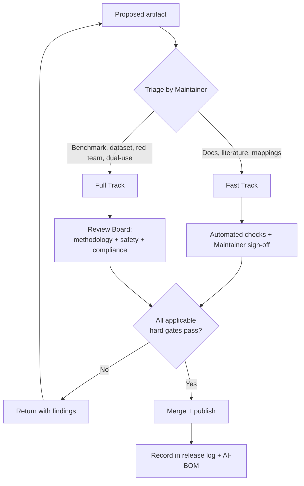

# Release Governance

Most responsible-AI evaluation sites publish *findings*. Few publish the **rule for when a finding is allowed to be published at all**. This page closes that gap.

An evaluation framework is unusual: the material it produces — adversarial prompts, stressed datasets, red-team evidence, capability scores — can itself carry dual-use risk. Releasing a benchmark is not like releasing a tutorial. So this framework treats every contribution as a *governed artifact* that must clear an explicit review before it becomes part of the public site or repository.

The model below is adapted from the Open Source Programme Office (OSPO) two-track pattern used in financial-services AI labs, specialised here for an evaluation context where the published artifact can create harmful uplift.

!!! abstract "What this page gives you"
    A defensible, auditable answer to: *"Who decided this benchmark was safe and sound enough to publish, against what criteria, and where is that recorded?"*

## Scope — what counts as a governed artifact

A contribution is **in scope** if it adds or changes any of the following:

- A benchmark module (bias, toxicity, truthfulness, robustness, red-teaming)
- A dataset, including stressed or adversarial variants
- Red-team evidence or escalation findings
- An entry in the [Threat Assessment](../threats/adversarial-ml-taxonomy/) taxonomy
- Scoring logic or [Metrics & KPIs](../evaluation/metrics/)
- A [Governance Mapping](../governance_mapping/) or [UNESCO EIA](../eia/) crosswalk

Pure documentation, literature summaries, and link or typo fixes are still governed, but on the lighter of the two tracks.

## Two-track review

The track is chosen by the **content's risk surface**, not by who submitted it.

| | Fast Track | Full Track |
| --- | --- | --- |
| **Applies to** | Documentation, literature reviews, framework/governance mappings, metadata, typo and link fixes | New benchmark modules, datasets (incl. stressed/adversarial), red-team evidence, threat-taxonomy changes, dual-use content, any change to scoring logic |
| **Reviewer** | Maintainer + automated checks | Review Board (methodology · safety & dual-use · governance & compliance) |
| **Target SLA** | < 1 working day | 1–3 weeks |
| **Hard gates** | Provenance · Licensing · Traceability | All five gates |

## The lifecycle

## Review roles

The Board is defined by **function, not headcount**. In a solo or small-team setting one person may hold several roles, but each gate is signed off explicitly and separately so the audit trail still shows *which lens* cleared the artifact.

| Role | Lens | Responsible for |
| --- | --- | --- |
| **Maintainer / Framework Lead** | Ownership | Triage, track assignment, final merge, release log |
| **Methodology reviewer** | Is the evaluation *sound*? | Reproducibility, baselines, seeds, statistical claims |
| **Safety & dual-use reviewer** | Should this be *public*? | Harmful-uplift assessment, redaction/access-control of red-team artifacts, ASL/RSP escalation relevance |
| **Governance & compliance reviewer** | Is this *permitted*? | Data provenance, licensing, GDPR/ethics-approval scope, export-control sensitivity |

!!! note "Why a dedicated dual-use lens"
    Red-team prompts and stressed datasets sit close to the line between *evaluation* and *capability enablement*. The safety reviewer's job is to ask whether the public version of an artifact gives a bad actor more than it gives a defender — and, where it does, to require redaction, gating, or a synthetic substitute before release.

## Hard gates

A gate is **hard**: an artifact does not publish until every applicable gate is marked *pass*. Gates are recorded individually, not as a single approval.

| Gate | Question it answers | Fails if |
| --- | --- | --- |
| **Provenance** | Where did the data come from? | Real personal data, scraped-without-licence content, or an undocumented source |
| **Dual-use** | Does publication create net harmful uplift? | Capability detail or attack content that materially aids misuse and is not redacted or access-controlled |
| **Methodology** | Is the result reproducible? | No documented protocol, non-deterministic without seeds, or no baseline |
| **Traceability** | Does it map to a recognised framework? | No link to NIST AI RMF, EU AI Act, ISO/IEC 42001, or UNESCO EIA |
| **Licensing** | Can it legally be published? | Incompatible upstream licence or missing attribution |

!!! warning "Synthetic or anonymised data only"
    This framework publishes **synthetic, anonymised, or openly licensed data only**. No real customer, employee, or third-party personal data is published in any benchmark, dataset, or example. This is a release condition, not a guideline.

## Community-health files

Release governance is only credible if its supporting documents exist in the repository root (or `.github/`). This framework maintains:

- **`GOVERNANCE.md`** — this lifecycle, the roles, and the gate definitions
- **`CONTRIBUTING.md`** — how to propose an artifact and which track it will take
- **`SECURITY.md`** — responsible-disclosure path for vulnerabilities and for harmful content discovered in a published artifact
- **`CODE_OF_CONDUCT.md`** — Contributor Covenant v2.1

## Crosswalk to the rest of the framework

Release governance is the *process* layer that sits above the *content* layers documented elsewhere:

| This page governs… | …against criteria defined in |
| --- | --- |
| Whether a benchmark may publish | [Methodology](../methodology/) and [Scoring](../scoring/) |
| Whether red-team evidence may publish | [Red Teaming](../benchmarks/red-teaming/) and [Adversarial ML Taxonomy](../threats/adversarial-ml-taxonomy/) |
| What is recorded at release | [AI Bill of Materials](../supply-chain/ai-bom/) |
| How the artifact maps to obligations | [Governance Mapping](../governance_mapping/) and [UNESCO EIA](../eia/) |

## Release record

Every published artifact carries a one-line entry in the release log: *date · artifact · track · gates passed · reviewer role(s) · linked AI-BOM ID*. The log is the framework's audit trail — the evidence that the rule on this page was actually applied, not merely stated.
