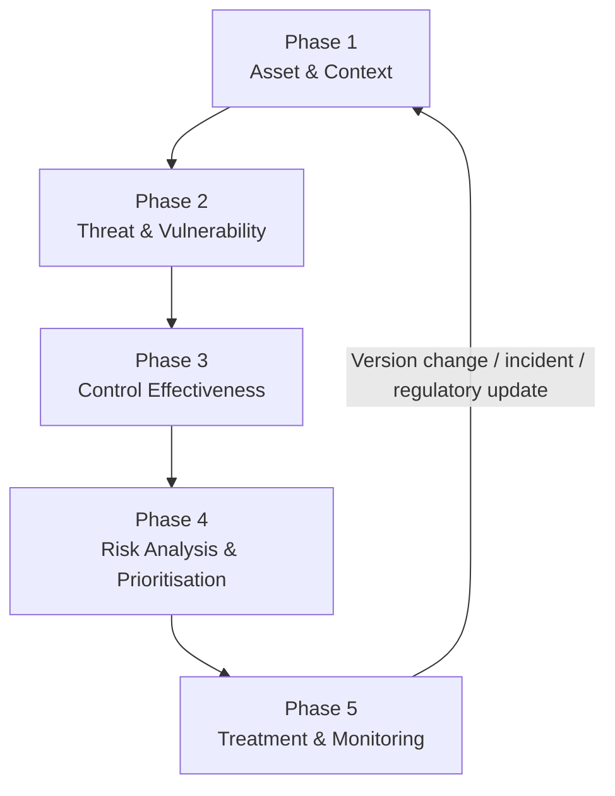

# Five-Phase Assessment Methodology

This page translates the five-phase cybersecurity risk assessment methodology from *Comprehensive Cybersecurity Risk Assessment Framework* (Lago, 2026) into a Responsible AI evaluation workflow. Each phase maps to activities supported by the framework's benchmark adapters, evaluation harness, and governance documentation.

---

## Workflow Overview

---

## Phase 1 — Asset and Context Identification

### Purpose
Establish what is being evaluated, its deployment context, regulatory obligations, and compute profile before any testing begins.

### Inputs
- Model identifier, version, and system card
- Intended use cases and foreseeable misuse cases
- Deployment architecture (API, on-premise, embedded, RAG pipeline)
- Jurisdictional scope relevant to EAR 3A090/4E091, the AI Diffusion Framework, and DESC Law 15/2024
- Training compute profile (parameter count, FLOPs relative to the 10²⁶ threshold)

### Activities

| Activity | Framework Support |
|---|---|
| Enumerate model assets (weights, APIs, datasets, pipelines) | `evaluation/session_memory.py` — provenance logging |
| Identify data subjects and affected communities | UNESCO EIA [Part 1 — Scoping](../eia/scoping.md) |
| Map regulatory obligations by jurisdiction | [Regulatory Crosswalk](../eia/crosswalk.md) |
| Classify compute tier against export control thresholds | [Governance Mapping](../governance_mapping.md) |
| Record AI Bill of Materials | [AI Bill of Materials](../supply-chain/ai-bom.md) |

### Outputs
- Version-pinned asset register
- Regulatory obligation matrix
- Compute tier classification (above / below 10²⁶ FLOPs threshold)
- Initial AI-BOM entry

!!! note "Export Control Relevance"
    Systems trained above the 10²⁶ FLOPs threshold may be subject to EAR classification 3A090/4E091 and the US AI Diffusion Framework export licensing requirements. Capture this in Phase 1 before cross-border API testing begins.

---

## Phase 2 — Threat and Vulnerability Analysis

### Purpose
Identify the adversarial threat landscape applicable to the model asset profile, map known attack vectors, and surface exploitable vulnerabilities before control evaluation.

### Inputs
- Asset register (Phase 1 output)
- [Adversarial ML Taxonomy](../threats/adversarial-ml-taxonomy.md)
- MITRE ATLAS v2.1 technique catalogue
- Prior red-team reports and disclosed incidents

### Activities

| Activity | Framework Support |
|---|---|
| Map applicable ATLAS tactics to asset profile | [ATLAS × AI RMF Matrix](../mappings/atlas-airmf-matrix.md) |
| Execute automated vulnerability probes | `benchmarks/cybergym_glasswing.py` |
| Run preliminary membership inference assessment | `evaluation/agentic_autonomy.py` |
| Document threat actors and likely attack paths | UNESCO EIA [Part 2 — Principles](../eia/principles.md) |

### Outputs
- Threat model: threat actor × attack vector matrix
- Preliminary vulnerability list with severity estimates
- ATLAS technique mapping

!!! warning "LLM-Specific Threat Surface"
    Prompt injection (direct, indirect via RAG, multi-turn) and harmful output are distinct from classical adversarial examples. Both require separate test procedures; see [Test Catalogue](../evaluation/test-catalogue.md).

---

## Phase 3 — Control Effectiveness Evaluation

### Purpose
Test whether deployed safeguards prevent or detect the threats identified in Phase 2. This is the primary benchmark execution phase.

### Inputs
- Threat model (Phase 2 output)
- Benchmark configurations (`benchmarks/*/config.yaml`)
- Control inventory (rate limiting, input filters, output filters, RLHF alignment)

### Activities

| Activity | Benchmark / Tool |
|---|---|
| Adversarial robustness testing | `benchmarks/cybergym_glasswing.py`, AdvGLUE, PromptBench |
| Bias and fairness evaluation | `benchmarks/bias/` — StereoSet, CrowS-Pairs, WinoBias |
| Toxicity and harmful output detection | `benchmarks/toxicity/` — RealToxicityPrompts |
| Truthfulness and hallucination rate | `benchmarks/truthfulness/` — TruthfulQA |
| Safety consistency under memory | `benchmarks/membench_rai.py` |
| Prompt injection resistance | Custom test suite (direct, indirect, multi-turn) |
| Membership inference risk | Shadow model attack on held-out split |
| Model extraction feasibility | Knockoff Nets / DFME within query budget |

### Outputs
- Benchmark results (versioned JSON in `results/`) per [Scoring](../scoring.md)
- Control gap list: threats not addressed by existing controls
- Evidence artefacts for audit (logged in `evaluation/session_memory.py`)

---

## Phase 4 — Risk Analysis and Prioritisation

### Purpose
Aggregate benchmark results, weight by threat likelihood and impact severity, and produce a prioritised risk register.

### Inputs
- Benchmark results (Phase 3 output)
- Threat model (Phase 2 output)
- Governance thresholds from [Governance Mapping](../governance_mapping.md)

### Risk Prioritisation Matrix

| | Low Impact | Medium Impact | High Impact |
|---|---|---|---|
| **High Likelihood** | Medium | High | Critical |
| **Medium Likelihood** | Low | Medium | High |
| **Low Likelihood** | Negligible | Low | Medium |

Critical findings block deployment. High findings require documented mitigations with owner and deadline before sign-off.

### Activities

| Activity | Framework Support |
|---|---|
| Score against NIST AI RMF Measure subcategories | [ATLAS × AI RMF Matrix](../mappings/atlas-airmf-matrix.md) |
| Apply framework safety thresholds | [Scoring](../scoring.md), [Metrics & KPIs](../evaluation/metrics.md) |
| Assign ASL level (ASL-2 / ASL-2 elevated / ASL-3) | [Governance Mapping](../governance_mapping.md) |
| Populate impact register | UNESCO EIA [Part 3 — Impact Mapping](../eia/impact-mapping.md) |

### Outputs
- Prioritised risk register with likelihood × impact scores
- ASL classification for the evaluated model
- Deployment recommendation (proceed / proceed with mitigations / do not deploy)

---

## Phase 5 — Treatment Planning and Continuous Monitoring

### Purpose
Define and execute mitigations for prioritised risks, establish monitoring cadence, and set re-evaluation triggers.

### Treatment Options

| Option | When to Use |
|---|---|
| **Control uplift** | Technical mitigation closes the gap (e.g., add output filter, increase DP budget) |
| **Scope reduction** | Deployment restricted to lower-risk contexts |
| **Risk acceptance** | Residual risk formally accepted with sign-off at appropriate authority level |
| **Risk transfer** | Contractual liability shifted to supplier or operator |

### Monitoring Cadence

| Dimension | Continuous | Monthly | Quarterly |
|---|---|---|---|
| Toxicity drift (production sampling) | ✓ | | |
| Supply chain integrity (dependency audit) | ✓ | | |
| Adversarial robustness regression (PromptBench) | | ✓ | |
| Bias metrics (StereoSet + CrowS-Pairs) | | | ✓ |
| Membership inference risk | | | ✓ |
| Model extraction feasibility | | | ✓ |

### Re-evaluation Triggers

A full five-phase re-evaluation is mandatory when any of the following occur:

- Model weights are updated (any fine-tuning or RLHF revision)
- Deployment scope expands to new jurisdictions or use cases
- A security incident is reported affecting the model or its supply chain
- A regulatory change introduces new obligations (EU AI Act implementing acts, UAE DESC Law 15/2024 revisions)
- Benchmark scores degrade more than 5 percentage points versus the prior evaluation baseline

### Outputs
- Mitigation plan: risk → control → owner → deadline → evidence
- Monitoring configuration for production alerting
- Signed assessment record (UNESCO EIA Stage 6 sign-off)
- Next scheduled review date in governance register

---

## Regulatory Alignment

| Framework | Phase Mapping |
|---|---|
| NIST AI RMF | Map → Phases 1–2; Measure → Phase 3; Govern + Manage → Phases 4–5 |
| EU AI Act Art. 9 | Iterative risk management system = Phases 1–5 repeated per version |
| ISO/IEC 42001 | Clause 6.1 (risk assessment) = Phases 1–4; Clause 8 (operations) = Phase 5 |
| CoE HUDERIA | Stages 1–3 = Phases 1–2; Stages 4–5 = Phases 3–5 |
| UNESCO EIA | Parts 1–3 embedded across all five phases |

---

## References

- Lago, F. (2026). *Comprehensive Cybersecurity Risk Assessment Framework*. June 2026.
- NIST (2023). *AI Risk Management Framework (AI RMF 1.0)*. National Institute of Standards and Technology. <https://doi.org/10.6028/NIST.AI.100-1>
- MITRE (2024). *ATLAS: Adversarial Threat Landscape for Artificial-Intelligence Systems*, v2.1. MITRE Corporation. <https://atlas.mitre.org>
- ISO/IEC (2023). *ISO/IEC 42001:2023 — Artificial Intelligence: Management System*. International Organisation for Standardisation.
- BIS (2025). *Export Administration Regulations — Advanced Computing Items* (ECCNs 3A090, 4E091). US Department of Commerce Bureau of Industry and Security.
- MOCIAT (2024). *DESC Law 15/2024 on Regulation of Artificial Intelligence in Dubai*. Dubai Electronic Security Center.
